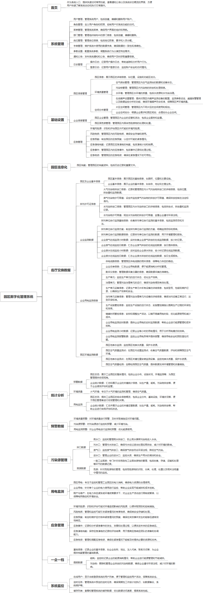

 

    
 

公司拥有上百套具有自主知识产权的软件系统，详情请查看码云首页或公司官网

 
<h1>园区环境数字化管理系统</h1>

<a href="https://www.haishi.net.cn/">公司官网</a> ｜ <a href="https://www.haishi.net.cn/">在线体验</a>

 

## 系统介绍

园区环境管理系统是一个综合性的信息化平台，旨在实现园区内企业和环境数据的全面监控、管理与分析。系统涵盖了多个模块，包括园区基本信息管理、企业环境数据监测、排污许可证管理、污染物监测、应急管理、环境风险预警等。通过实时采集和分析园区内的空气质量、水环境、噪声、固废管理等环境数据，系统能够提供决策支持，优化资源配置，推动环境质量提升。它还包括多项管理功能，如环境风险源管理、应急预案与演练、污染治理设施管理等，确保园区内的企业在符合环保法规的同时，能够及时应对突发的环境问题。此外，系统提供了详尽的数据导出与统计分析功能，帮助管理者对园区环境状况进行定期评估和预警，进一步推动绿色发展和可持续运营。
园区环境管理系统是一个综合性的信息化平台，旨在实现园区内企业和环境数据的全面监控、管理与分析。系统涵盖了多个模块，包括园区基本信息管理、企业环境数据监测、排污许可证管理、污染物监测、应急管理、环境风险预警等。通过实时采集和分析园区内的空气质量、水环境、噪声、固废管理等环境数据，系统能够提供决策支持，优化资源配置，推动环境质量提升。它还包括多项管理功能，如环境风险源管理、应急预案与演练、污染治理设施管理等，确保园区内的企业在符合环保法规的同时，能够及时应对突发的环境问题。此外，系统提供了详尽的数据导出与统计分析功能，帮助管理者对园区环境状况进行定期评估和预警，进一步推动绿色发展和可持续运营。
本项目旨在为园区提供数字化管理解决方案，涵盖园区信息化、污染源管理、用电监测、应急管理、一企一档、系统监控等多个方面。通过整合园区内各类数据，实现园区管理的智能化、精细化和高效化。
                

## 系统功能介绍

### 系统包含终端说明

管理端（WEB）

| 序号 | 模块 | 模块说明 |
| --- | --- | --- |
| 1 | ZF-ZHYQ-HJGL-SERVER | 服务端 |
| 2 | ZF-ZHYQ-HJGL-MANAGE | 管理端 |

### 系统功能结构

### 系统功能说明

**系统管理**
- 用户管理
- 角色管理
- 菜单管理
- 部门管理
- 岗位管理
- 通知公告
- 日志管理
**基础设置**
- 园区信息管理
- 园区信息
- 环境质量管理
- 空气微站管理
- 污染物管理
- 水环境
- 在线噪声设施管理
- 空间分布管理
- 片区空间管理
- 企业空间划分
- 企业信息管理
- 园区企业管理
- 园区固危废管理
- 应急管理
- 环境风险源
- 风险物质
- 应急预案
- 应急演练档案
- 应急事件
- 应急物资
**园区信息化**
- 园区档案
**省厅交换数据**
- 园区及企业基本信息
- 园区基本信息
- 企业基本信息
- 排污许可证信息
- 大气污染物排放口信息
- 废弃污染物许可限值
- 水污染物排放口信息
- 水污染物许可限值
- 企业监测数据
- 排污单位自行监测基础信息
- 排污单位自行监测方案
- 排污单位自行监测数据信息
- 企业废气在线监测小时数据
- 企业废气在线监控日数据
- 企业废水在线监控小时数据
- 企业废水在线监控日数据
- 企业用电监测信息
- 供电线路信息
- 企业总表信息
- 数采以信息
- 生产单元
- 治理单元
- 生产单元设备信息
- 治污单元设备信息
- 生产设施管控信息
- 错峰时间管控信息
- 企业用电监测实时数据
- 企业用电监测小时数据
- 企业用电监测报警信息
- 园区环境监测数据
- 园区空气质量检测点
- 园区地表水监测点
- 园区空气质量检测
- 园区地表水监测
**统计分析**
- 预警数据
- 园区总览
- 企业统计数据
- 环境质量
- 大气环境
- 用电监测
- 园区总览
- 企业统计数据
**预警数据**
- 环境质量预警
- 污染物预警
- 用电监测预警
**污染源管理**
- 排口数据
- 雨水口
- 污水口
- 废弃口
- 进水口
- 固废数据
- 一般工业固废
- 危废
**用电监测**
- 园区用电
- 企业用电
- 限产与停产
**应急管理**
- 环境风险源
- 风险物质
- 应急预案
- 应急事件
- 应急演练档案
- 应急物资
**一企一档**
- 基础信息
- 提报数据
- 能耗
- 污染物
**系统监控**
- 在线用户
- 定时任务
- 可视化大屏

## 系统主要界面

## 系统技术说明

### 代码模块说明

| 序号 | 目录 | 目录说明 |
| --- | --- | --- |
| 1 | ZF-ZHYQ-HJGL-SERVER/zhyq-quartz | -- |
| 2 | ZF-ZHYQ-HJGL-SERVER/zhyq-framework | -- |
| 3 | ZF-ZHYQ-HJGL-SERVER/zhyq-admin | -- |
| 4 | ZF-ZHYQ-HJGL-SERVER/zhyq-common | -- |
| 5 | ZF-ZHYQ-HJGL-SERVER/zhyq-system | -- |
| 6 | ZF-ZHYQ-HJGL-SERVER/zhyq-generator | -- |
| 7 | ZF-ZHYQ-HJGL-SERVER/.idea | -- |

### 系统技术选型

#### 开发语言/框架

JAVA（JDK1.8）
脚手架：RuoYi
前端框架：VUE2
框架：SpringBoot2.x
系统结构：单体应用

#### 服务中间件

Nginx
Tomcat

#### 数据库

MySQL（5.7+）
Redis
PGSQL

#### 其他说明

无

## 系统演示/商用

请扫码添加客服微信获取演示地址和系统详细资料。

如果您想基于园区环境数字化管理系统进行商业化交付或定制开发服务，我们提供有偿的技术服务支持，合作模式不限，欢迎沟通！

公司官网地址： <a href="https://www.haishi.net.cn/">https://www.haishi.net.cn</a>

联系客服获取专业回答。

## 使用须知

1、 本项目商用必须获得版权所有者的授权。

2、 未经允许本项目代码不允许二次出售。

